# Detailed Architecture

*Technical deep-dive into system design and data flow.*

---

## System Architecture Diagram

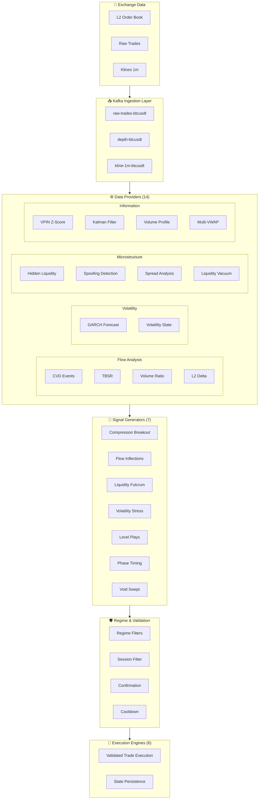

---

## Event Flow Architecture

### Data Provider to Signal Generator Flow

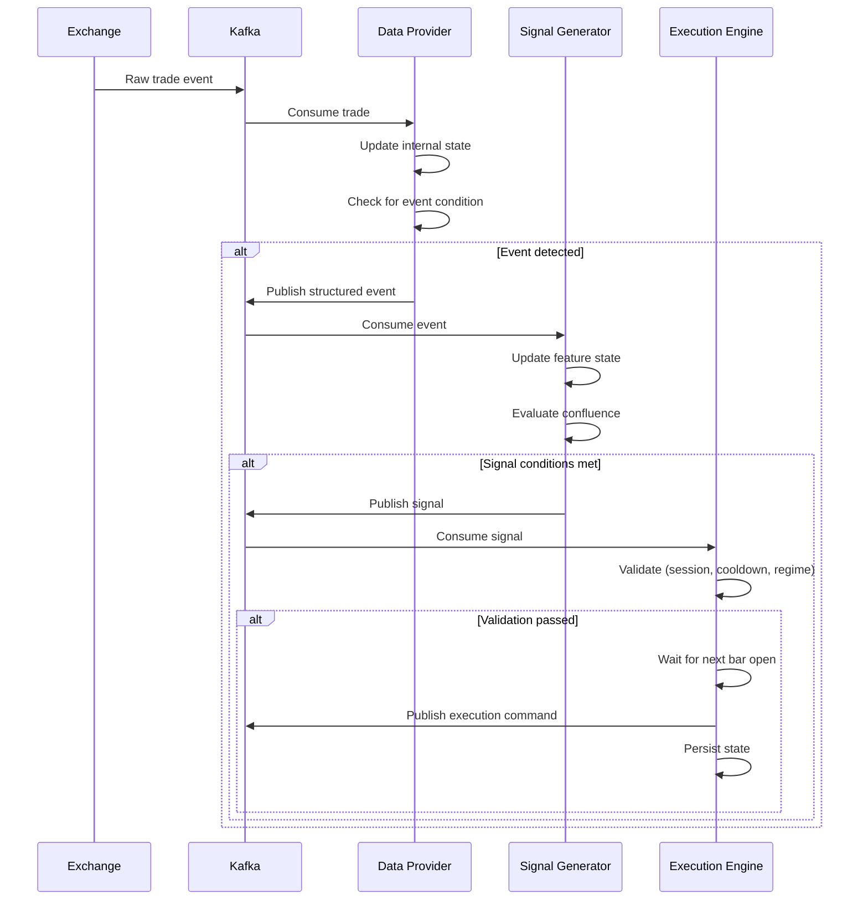

---

## State Management

### Data Provider State

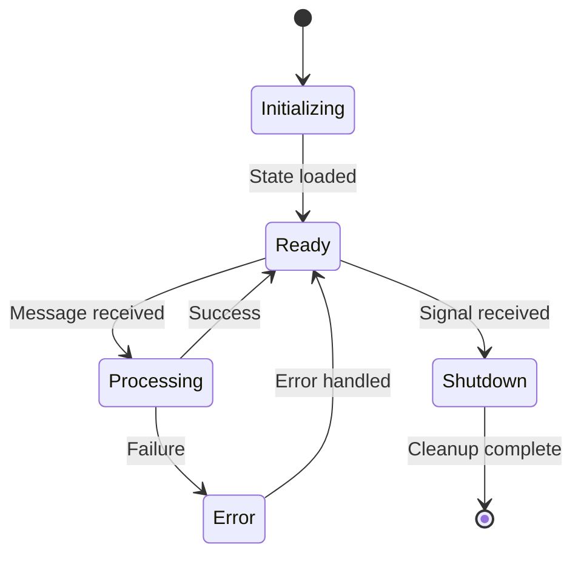

### Execution Engine State

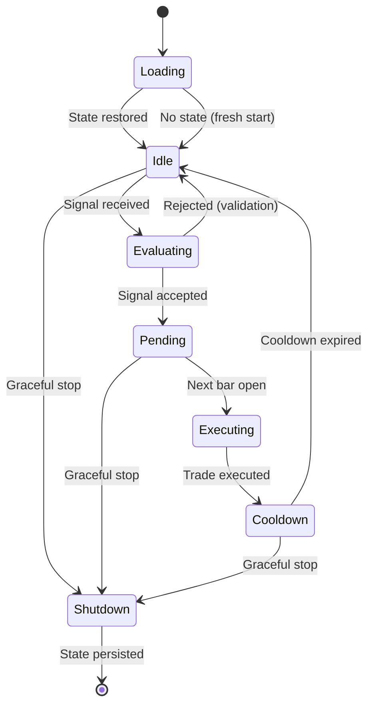

---

## Confirmation Flow

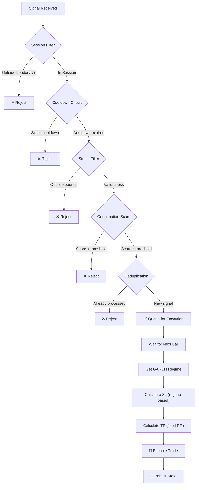

---

## GARCH Regime Adaptation

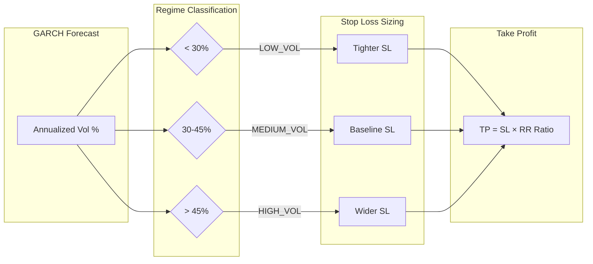

---

## Kafka Topic Topology

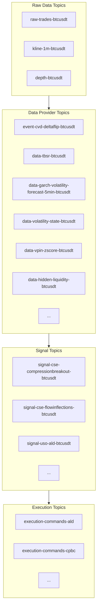

---

## Failure Handling

### Data Staleness Detection

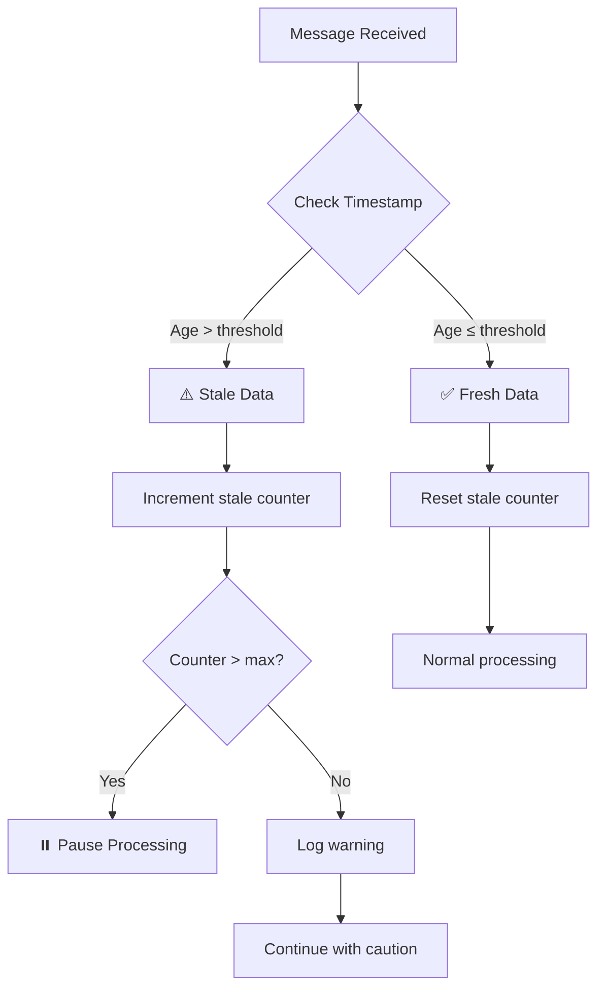

### State Recovery

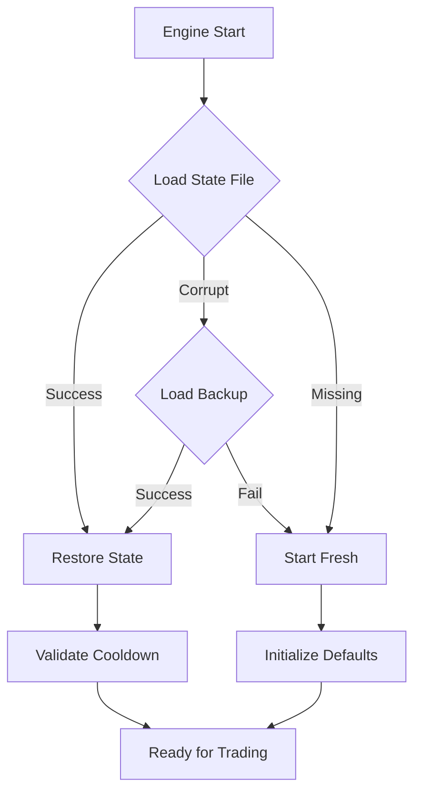

---

## Processing Pipeline

### Batch Processing with Safe Commits

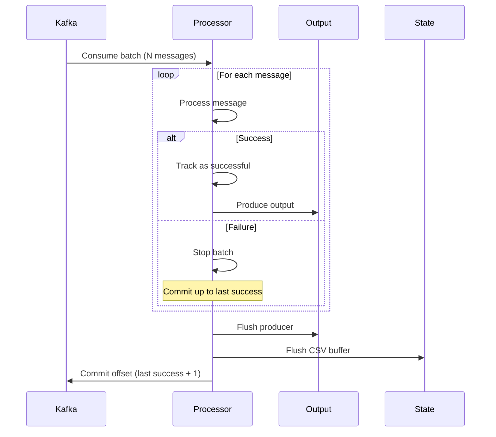

---

## Performance Monitoring

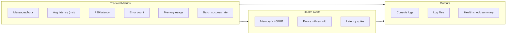

---

## Deployment Architecture

```
┌─────────────────────────────────────────────────────────────────┐
│                      PRODUCTION DEPLOYMENT                       │
├─────────────────────────────────────────────────────────────────┤
│                                                                  │
│   ┌─────────────┐     ┌─────────────┐     ┌─────────────┐      │
│   │  Exchange   │     │   Kafka     │     │  Zookeeper  │      │
│   │   Feed      │────▶│   Broker    │◀───▶│   Cluster   │      │
│   └─────────────┘     └──────┬──────┘     └─────────────┘      │
│                              │                                   │
│         ┌────────────────────┼────────────────────┐             │
│         │                    │                    │             │
│         ▼                    ▼                    ▼             │
│   ┌───────────┐        ┌───────────┐        ┌───────────┐      │
│   │    DP     │        │    DP     │        │    DP     │      │
│   │  Process  │        │  Process  │        │  Process  │      │
│   │   (1-5)   │        │  (6-10)   │        │ (11-14)   │      │
│   └─────┬─────┘        └─────┬─────┘        └─────┬─────┘      │
│         │                    │                    │             │
│         └────────────────────┼────────────────────┘             │
│                              │                                   │
│                              ▼                                   │
│                  ┌───────────────────────┐                      │
│                  │   Signal Generator    │                      │
│                  │      Processes        │                      │
│                  └───────────┬───────────┘                      │
│                              │                                   │
│                              ▼                                   │
│                  ┌───────────────────────┐                      │
│                  │   Execution Engines   │                      │
│                  │  (Stateful, HA-ready) │                      │
│                  └───────────────────────┘                      │
│                                                                  │
└─────────────────────────────────────────────────────────────────┘
```

---

*This architecture prioritizes reliability, debuggability, and deterministic behavior over raw performance.*
